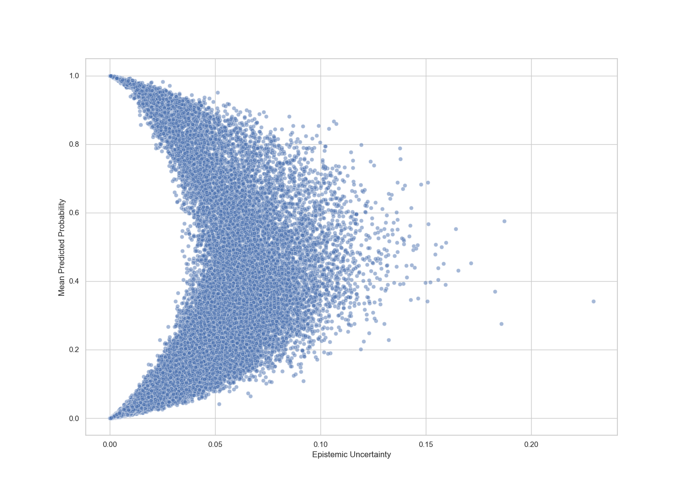
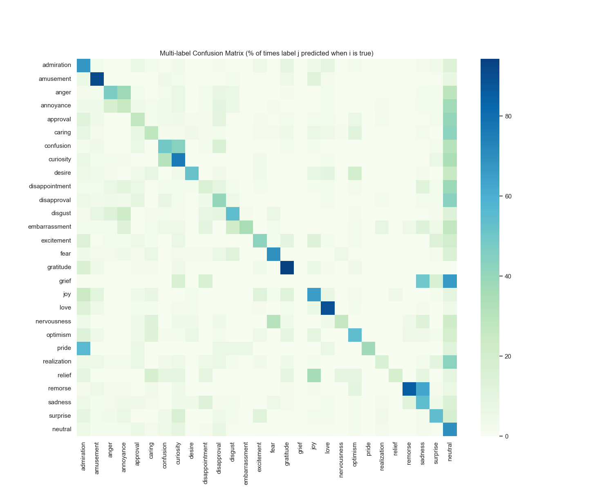
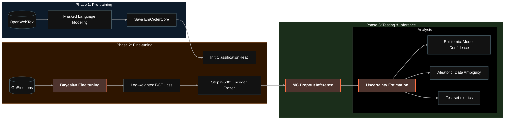

# EmCoder
> **Probabilistic Emotion Recognition & Uncertainty Quantification**<br>**28 Emotion multi-label classifier trained with MC Dropout methodology**<br>**https://huggingface.co/yezdata/EmCoder**


Unlike standard classifiers, EmCoder quantifies what it doesn't know using Monte Carlo Dropout, making it suitable for high-stakes AI pipelines.<br>
EmCoder is optimized for **MC Dropout inference**.


## SOTA benchmark
### Evaluation on the GoEmotions test split (macro avg metrics)
EmCoder achieves competitive F1-scores while being ~35% smaller than RoBERTa-base and ~45% smaller than ModernBERT, offering a superior efficiency-to-uncertainty ratio.
| Model | Precision | Recall | F1-Score | Params |
| :--- | :--- | :--- | :--- | :--- |
| **EmCoder (v1)** | **0.408** | **0.495** | **0.440** | **82.1M** |
| Google BERT (Original) | 0.400 | 0.630 | 0.460 | 110M |
| RoBERTa-base | 0.575 | 0.396 | 0.450 | 125M |
| ModernBERT-base | 0.652 | 0.443 | 0.500 | 149M |


## How to use
> EmCoder v1.0 uses the `roberta-base` tokenizer for correct token-to-embedding mapping.
### 1. Setup & Tokenization
```python
import torch
from transformers import AutoModel, AutoTokenizer

repo_id = "yezdata/EmCoder"

# Load the same tokenizer used during training
tokenizer = AutoTokenizer.from_pretrained(repo_id)

# Initialize with same config as training
model = AutoModel.from_pretrained(repo_id, trust_remote_code=True)
```
### 2. Bayesian inference
To obtain probabilistic outputs and uncertainty metrics, use the `mc_forward` method:
```python
# Perform 50 stochastic passes
N_SAMPLES = 50

inputs = tokenizer("I am so happy you are here!", return_tensors="pt")

model.eval()
with torch.no_grad():
    logits_mc = model.mc_forward(inputs['input_ids'], inputs['attention_mask'], n_samples=N_SAMPLES) # Automatically keeps Dropout active, even when in model.eval

# Bayesian Post-processing
probs_all = torch.sigmoid(logits_mc) # (n_samples, B, 28)

mean_probs = probs_all.mean(dim=0) # Mean Predicted Probability
uncertainty = probs_all.std(dim=0) # Epistemic Uncertainty (Standard Deviation)


# Formatted Output
m_probs = mean_probs.squeeze(0)
u_vals = uncertainty.squeeze(0)

print(f"{'Emotion':<15} | {'Prob':<10} | {'Uncertainty':<10}")
print("-" * 40)

sorted_indices = torch.argsort(m_probs, descending=True)

for idx in sorted_indices:
    prob, unc = m_probs[idx].item(), u_vals[idx].item()
    label = model.config.id2label[idx.item()]
    
    if prob > 0.05: # Print only emotions with prob > 5%
        print(f"{label:<15} | {prob:>8.2%} | ±{unc:>8.4f}")
```


## Model Architecture

```mermaid
flowchart LR
    subgraph InputGroup["Input Operations"]
        direction TB
        MCD_Loop(["MC-Inference 
        N_samples"]):::LoopNode
        ids["Batch IDs"]
        mask["Batch Mask"]
    end

    subgraph EmCoderCore["EmCoder Core"]
        direction LR
        tok_emb["Token Embedding"]
        ln_in["Input LayerNorm"]
        Transformer["Transformer Encoder"]
        final_norm["Final LayerNorm"]
        Dropout1[("MC-Dropout")]:::MCD
        Dropout2[("MC-Dropout")]:::MCD
    end

    subgraph ClassifierHead["Classifier Head"]
        direction TB
        pool["Masked Mean Pooling"]
        MLP["Classifier MLP"]
    end

    MCD_Loop -.-> ids
    ids ==> tok_emb
    tok_emb ==> ln_in
    ln_in -.-> Dropout1
    Dropout1 ==> Transformer
    mask ==> Transformer
    Transformer -.-> Dropout2
    Dropout2 ==> final_norm
    final_norm ==> pool
    mask ==> pool
    pool ==> MLP
    MLP ==> Out(["Class LogitsMC
    (N_samples, B, 28)"]):::OutNode
    Out ==> Avg(["Bayesian Post-processing"]):::BayesNode

    classDef MCD fill:#424242,stroke:#fbc02d,stroke-width:2px,stroke-dasharray: 5 5,color:#fff
    classDef OutNode fill:#0d47a1,stroke:#1976d2,stroke-width:3px,color:#fff,font-weight:bold
    classDef BayesNode fill:#3e2723,stroke:#ff7043,stroke-width:2px,color:#fff
    classDef LoopNode fill:#263238,stroke:#78909c,stroke-width:2px,color:#fff,font-style:italic
    
    linkStyle 1,2,4,7,8,9,10,11 stroke:#eceff1,stroke-width:2px
    linkStyle 3,5,6 stroke:#fbc02d,stroke-width:2px
```



### Optimization
The model is trained using a Weighted Bayesian Binary Cross Entropy loss:

$$
\mathcal{L}_{Bayesian} = \frac{1}{T} \sum_{t=1}^{T} \text{BCEWithLogits}(z^{(t)}, y; w)
$$

Where weights $w$ are calculated using a logarithmic class-balancing scale to handle extreme label imbalance:

$$
w_{c} = \max\left( 0.1, \min\left( 20, 1 + \ln \left( \frac{N_{neg,c} + \epsilon}{N_{pos,c} + \epsilon} \right) \right) \right)
$$


## Performance
**Using threshold of 0.5 for binarizing predictions**
|                |   precision |   recall |   f1-score |   support |
|:---------------|------------:|---------:|-----------:|----------:|
| micro avg      |       0.494 |    0.596 |      0.54  |      6329 |
| macro avg      |       0.408 |    0.495 |      0.44  |      6329 |
| weighted avg   |       0.492 |    0.596 |      0.535 |      6329 |
| samples avg    |       0.525 |    0.616 |      0.544 |      6329 |
|----------------|-------------|----------|------------|-----------|
| admiration     |       0.541 |    0.673 |      0.599 |       504 |
| amusement      |       0.688 |    0.909 |      0.783 |       264 |
| anger          |       0.419 |    0.47  |      0.443 |       198 |
| annoyance      |       0.31  |    0.25  |      0.277 |       320 |
| approval       |       0.304 |    0.271 |      0.287 |       351 |
| caring         |       0.229 |    0.281 |      0.252 |       135 |
| confusion      |       0.26  |    0.497 |      0.342 |       153 |
| curiosity      |       0.432 |    0.764 |      0.552 |       284 |
| desire         |       0.453 |    0.518 |      0.483 |        83 |
| disappointment |       0.176 |    0.152 |      0.163 |       151 |
| disapproval    |       0.279 |    0.404 |      0.33  |       267 |
| disgust        |       0.447 |    0.545 |      0.491 |       123 |
| embarrassment  |       0.325 |    0.351 |      0.338 |        37 |
| excitement     |       0.288 |    0.427 |      0.344 |       103 |
| fear           |       0.47  |    0.692 |      0.56  |        78 |
| gratitude      |       0.834 |    0.943 |      0.885 |       352 |
| grief          |       0     |    0     |      0     |         6 |
| joy            |       0.445 |    0.652 |      0.529 |       161 |
| love           |       0.724 |    0.895 |      0.801 |       238 |
| nervousness    |       0.24  |    0.261 |      0.25  |        23 |
| optimism       |       0.483 |    0.543 |      0.511 |       186 |
| pride          |       0.667 |    0.375 |      0.48  |        16 |
| realization    |       0.226 |    0.166 |      0.191 |       145 |
| relief         |       0.222 |    0.182 |      0.2   |        11 |
| remorse        |       0.516 |    0.857 |      0.644 |        56 |
| sadness        |       0.405 |    0.545 |      0.464 |       156 |
| surprise       |       0.429 |    0.539 |      0.478 |       141 |
| neutral        |       0.602 |    0.695 |      0.645 |      1787 |


**Model uncertainty estimation**


**Confusion matrix**



## Workflow



### Note
Note that this model was trained on GoEmotions dataset (social networks domain) and it may not generalize well to other domains.


## Citation
If you use this model, please cite it as follows:

```bibtex
@software{jez2026emcoder,
  author = {Václav Jež},
  title = {EmCoder: Probabilistic Emotion Recognition & Uncertainty Quantification},
  year = {2026},
  publisher = {GitHub},
  journal = {GitHub repository},
  howpublished = {\url{https://github.com/yezdata/emcoder}},
  version = {1.0.0}
}
```