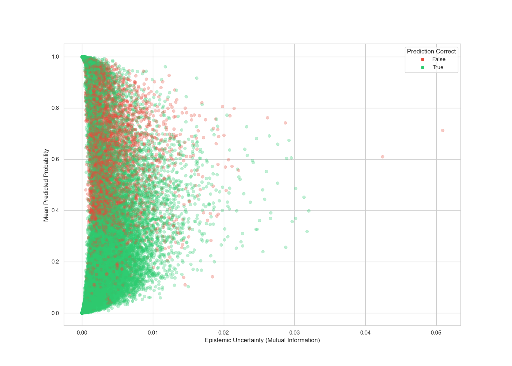
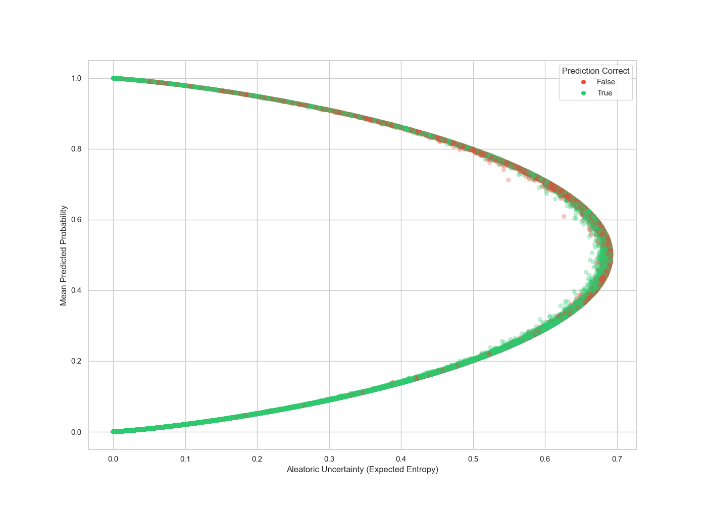
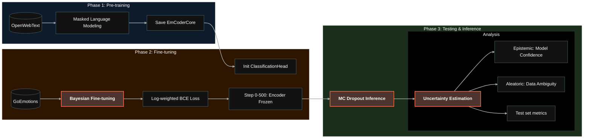

# EmCoder
> **Probabilistic Emotion Recognition & Uncertainty Quantification**<br>**28 Emotion multi-label Transformer classifier**<br>**https://huggingface.co/yezdata/EmCoder**


Unlike standard classifiers, EmCoder quantifies what it doesn't know using Monte Carlo Dropout, making it suitable for high-stakes AI pipelines.<br>
EmCoder is optimized for **MC Dropout inference**.


## SOTA benchmark
### Evaluation on the GoEmotions test split (macro avg metrics)
EmCoder achieves competitive F1-score with its compact size (~35% smaller than RoBERTa-base and ~45% smaller than ModernBERT), while providing per-class epistemic uncertainty quantification.
| Model | Precision | Recall | F1-Score | Params |
| :--- | :--- | :--- | :--- | :--- |
| **EmCoder** | **0.469** | **0.486** | **0.463** | **82.1M** |
| Google BERT (Original) | 0.400 | 0.630 | 0.460 | 110M |
| RoBERTa-base | 0.575 | 0.396 | 0.450 | 125M |
| ModernBERT-base | 0.583 | 0.535 | 0.550 | 149M |


## How to use
### 1. Setup & Tokenization
> EmCoder uses the `roberta-base` tokenizer for correct token-to-embedding mapping.
```python
import torch
from transformers import AutoModel, AutoTokenizer

repo_id = "yezdata/EmCoder"

# Load the same tokenizer used during training
tokenizer = AutoTokenizer.from_pretrained(repo_id)

# Initialize with same config as training
model = AutoModel.from_pretrained(repo_id, trust_remote_code=True)
```
### 2. Bayesian inference
To obtain probabilistic outputs and uncertainty metrics, use the `mc_forward` method:
```python
# Perform 50 stochastic passes
N_SAMPLES = 50
MAX_BATCH_SIZE = 10 # optional sub-batching of N_SAMPLES

inputs = tokenizer("I am so happy you are here!", return_tensors="pt")

model.eval()
with torch.no_grad():
    mc_logits = model.mc_forward(inputs['input_ids'], inputs['attention_mask'], n_samples=N_SAMPLES, max_batch_size=MAX_BATCH_SIZE) # Automatically keeps Dropout active, even when in model.eval

# Bayesian Post-processing
all_probs = torch.sigmoid(mc_logits) # (n_samples, B, 28)

mean_probs = all_probs.mean(dim=0) # Mean Predicted Probability
uncertainty = all_probs.std(dim=0) # Epistemic Uncertainty


# Formatted Output
m_probs = mean_probs.squeeze(0)
u_vals = uncertainty.squeeze(0)

print(f"{'Emotion':<15} | {'Prob':<10} | {'Uncertainty':<10}")
print("-" * 40)

sorted_indices = torch.argsort(m_probs, descending=True)

for idx in sorted_indices:
    prob, unc = m_probs[idx].item(), u_vals[idx].item()
    label = model.config.id2label[idx.item()]
    
    if prob > 0.05: # Print only emotions with prob > 5%
        print(f"{label:<15} | {prob:>8.2%} | ±{unc:>8.4f}")
```


## Model Architecture

```mermaid
flowchart LR
    subgraph InputGroup["Input Operations"]
        direction TB
        MCD_Loop(["MC-Inference 
        N_samples"]):::LoopNode
        ids["Batch IDs"]
        mask["Batch Mask"]
    end

    subgraph EmCoderCore["EmCoder Core"]
        direction LR
        tok_emb["Token Embedding"]
        ln_in["Input LayerNorm"]
        Transformer["Transformer Encoder"]
        final_norm["Final LayerNorm"]
        Dropout1[("MC-Dropout")]:::MCD
        Dropout2[("MC-Dropout")]:::MCD
    end

    subgraph ClassifierHead["Classifier Head"]
        direction TB
        pool["Masked Mean Pooling"]
        MLP["Classifier MLP"]
    end

    MCD_Loop -.-> ids
    ids ==> tok_emb
    tok_emb ==> ln_in
    ln_in -.-> Dropout1
    Dropout1 ==> Transformer
    mask ==> Transformer
    Transformer -.-> Dropout2
    Dropout2 ==> final_norm
    final_norm ==> pool
    mask ==> pool
    pool ==> MLP
    MLP ==> Out(["Class LogitsMC
    (N_samples, B, 28)"]):::OutNode
    Out ==> Avg(["Bayesian Post-processing"]):::BayesNode

    classDef MCD fill:#424242,stroke:#fbc02d,stroke-width:2px,stroke-dasharray: 5 5,color:#fff
    classDef OutNode fill:#0d47a1,stroke:#1976d2,stroke-width:3px,color:#fff,font-weight:bold
    classDef BayesNode fill:#3e2723,stroke:#ff7043,stroke-width:2px,color:#fff
    classDef LoopNode fill:#263238,stroke:#78909c,stroke-width:2px,color:#fff,font-style:italic
    
    linkStyle 1,2,4,7,8,9,10,11 stroke:#eceff1,stroke-width:2px
    linkStyle 3,5,6 stroke:#fbc02d,stroke-width:2px
```


### Optimization
The model is trained using a **Weighted Binary Cross Entropy loss**  
Where weights $w$ are calculated using a logarithmic class-balancing scale to handle extreme label imbalance:

$$
w_{c} = \max\left( 0.1, \min\left( 20, 1 + \ln \left( \frac{N_{neg,c} + \epsilon}{N_{pos,c} + \epsilon} \right) \right) \right)
$$


## Performance on test set
**Using `thresholds.json` optimization of probabilty thresholds for binarizing predictions (from val set)**
|                |   precision |   recall |   f1-score |   support |
|:---------------|------------:|---------:|-----------:|----------:|
| micro avg      |       0.482 |    0.627 |      0.545 |      6329 |
| **macro avg**  |   **0.469** |**0.486** |  **0.463** |      6329 |
| weighted avg   |       0.508 |    0.627 |      0.550 |      6329 |
| samples avg    |       0.532 |    0.651 |      0.560 |      6329 |
|----------------|-------------|----------|------------|-----------|
| admiration     |       0.613 |    0.607 |      0.610 |       504 |
| amusement      |       0.724 |    0.886 |      0.797 |       264 |
| anger          |       0.384 |    0.535 |      0.447 |       198 |
| annoyance      |       0.230 |    0.431 |      0.300 |       320 |
| approval       |       0.229 |    0.436 |      0.300 |       351 |
| caring         |       0.262 |    0.281 |      0.271 |       135 |
| confusion      |       0.395 |    0.320 |      0.354 |       153 |
| curiosity      |       0.441 |    0.736 |      0.551 |       284 |
| desire         |       0.538 |    0.422 |      0.473 |        83 |
| disappointment |       0.221 |    0.152 |      0.180 |       151 |
| disapproval    |       0.242 |    0.536 |      0.333 |       267 |
| disgust        |       0.595 |    0.407 |      0.483 |       123 |
| embarrassment  |       0.556 |    0.405 |      0.469 |        37 |
| excitement     |       0.375 |    0.379 |      0.377 |       103 |
| fear           |       0.575 |    0.538 |      0.556 |        78 |
| gratitude      |       0.948 |    0.886 |      0.916 |       352 |
| grief          |       0.200 |    0.167 |      0.182 |         6 |
| joy            |       0.566 |    0.559 |      0.562 |       161 |
| love           |       0.762 |    0.861 |      0.809 |       238 |
| nervousness    |       0.333 |    0.174 |      0.229 |        23 |
| optimism       |       0.632 |    0.516 |      0.568 |       186 |
| pride          |       0.750 |    0.375 |      0.500 |        16 |
| realization    |       0.250 |    0.159 |      0.194 |       145 |
| relief         |       0.286 |    0.182 |      0.222 |        11 |
| remorse        |       0.547 |    0.839 |      0.662 |        56 |
| sadness        |       0.432 |    0.513 |      0.469 |       156 |
| surprise       |       0.483 |    0.504 |      0.493 |       141 |
| neutral        |       0.555 |    0.811 |      0.659 |      1787 |


### Entropy-based uncertainty quantification

<br>**Model uncertainty quantification on GoEmotions test set**  
| Mean probability vs Epistemic | Mean probability vs Aleatoric |
| :---: | :---: |
|  |  |


<br>**Demonstration of model uncertainty utilization**  
Compute F1 score while removing the most uncertain (epistemic) x % of positive and negative classified test samples


<br>**Emotion uncertainty distribution**  
| Epistemic | Aleatoric |
| :---: | :---: |
|  |  |


## Workflow

```mermaid
flowchart LR
    classDef StageNode fill:#121212,stroke:#546e7a,color:#fff;
    classDef HighlightNode fill:#4e342e,stroke:#ff7043,stroke-width:2px,color:#fff,font-weight:bold;

    subgraph PT ["Phase 1: Pre-training"]
        direction TB
        OWT[(OpenWebText)]:::StageNode --> MLM[Masked Language Modeling]:::StageNode
        MLM --> Core[Save EmCoderCore]:::StageNode
    end

    subgraph FT ["Phase 2: Fine-tuning"]
        direction TB
        Core --> Init[Init ClassificationHead]:::StageNode
        GE[(GoEmotions)]:::StageNode --> WBT[Bayesian Fine-tuning]:::HighlightNode
        WBT --> LogW[Log-weighted BCE Loss]:::StageNode
        LogW --> Freeze[Step 0-500: Encoder Frozen]:::StageNode
    end

    subgraph EV ["Phase 3: Testing & Inference"]
        direction TB
        Freeze --> MCD[MC Dropout Inference]:::HighlightNode
        MCD --> Unc[Uncertainty Estimation]:::HighlightNode
        
        subgraph Metrics ["Analysis"]
            Unc --> EPI[Epistemic: Model Confidence]:::StageNode
            Unc --> ALE[Aleatoric: Data Ambiguity]:::StageNode
            Unc --> CM[Test set metrics]:::StageNode
        end
    end

    style PT fill:#0d1b2a,stroke:#1b263b,color:#fff
    style FT fill:#2e1500,stroke:#5d2a00,color:#fff
    style EV fill:#1b2e1b,stroke:#2d4a2d,color:#fff
    style Metrics fill:#000,stroke:#333,color:#fff

    linkStyle default stroke:#aaa,stroke-width:2px;
```


### Note
Note that this model was trained on GoEmotions dataset (social networks domain) and it may not generalize well to other domains.


## Citation
If you use this model, please cite it as follows:

```bibtex
@software{jez2026emcoder,
  author = {Václav Jež},
  title = {EmCoder: Probabilistic Emotion Recognition & Uncertainty Quantification},
  year = {2026},
  publisher = {GitHub},
  journal = {GitHub repository},
  howpublished = {\url{https://github.com/yezdata/emcoder}},
  version = {1.0.0}
}
```