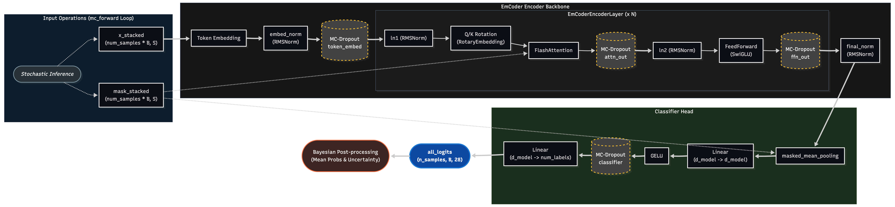
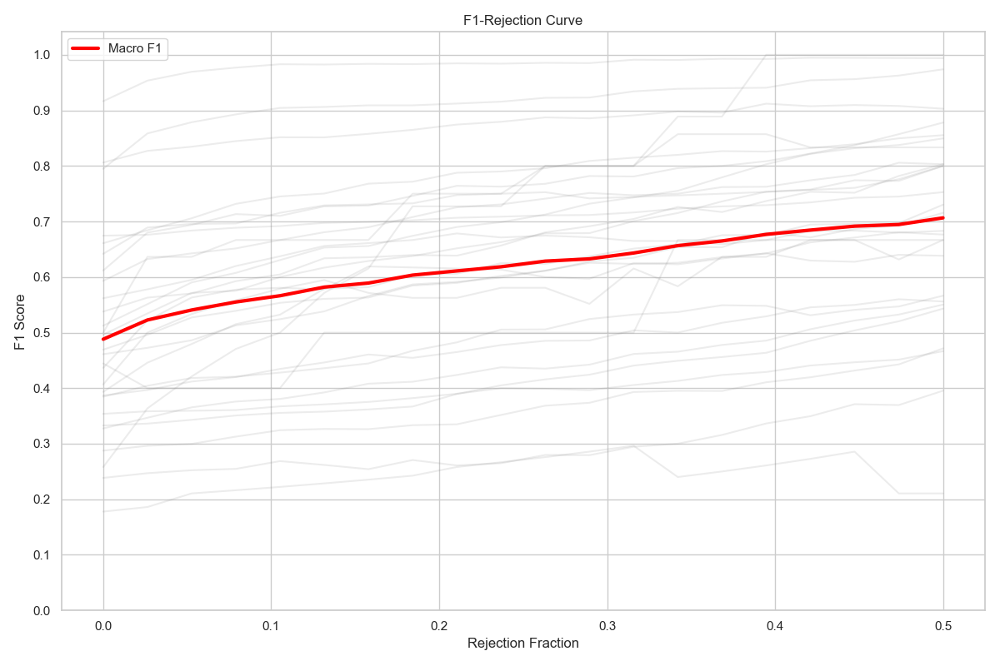
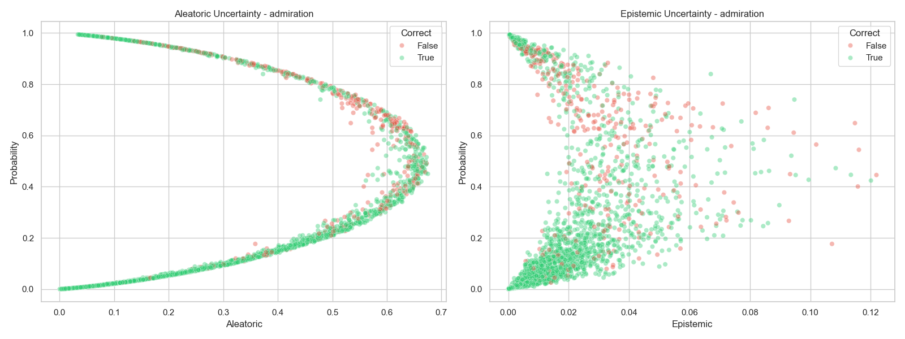
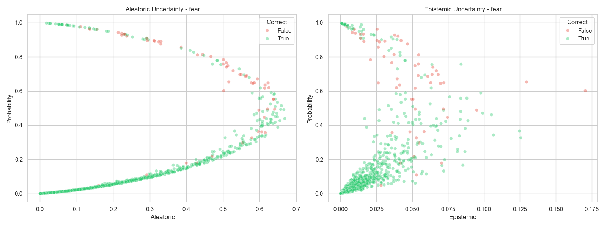
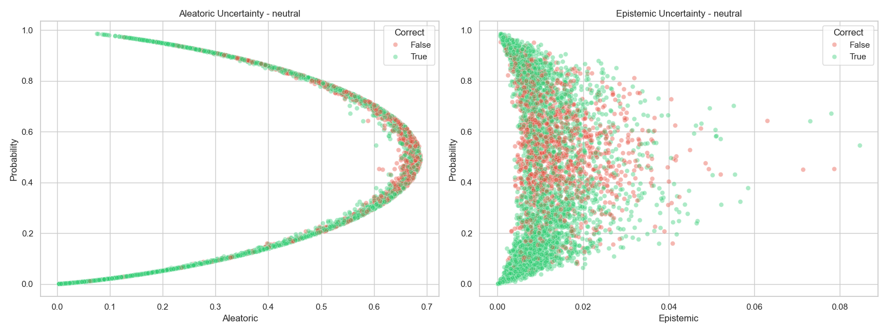
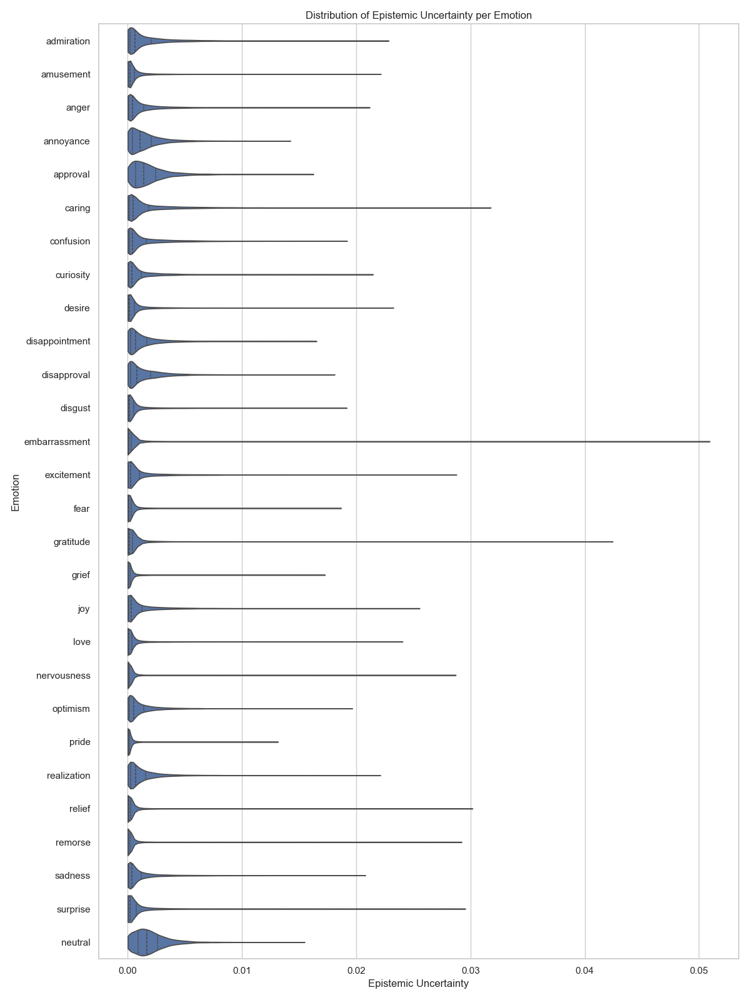
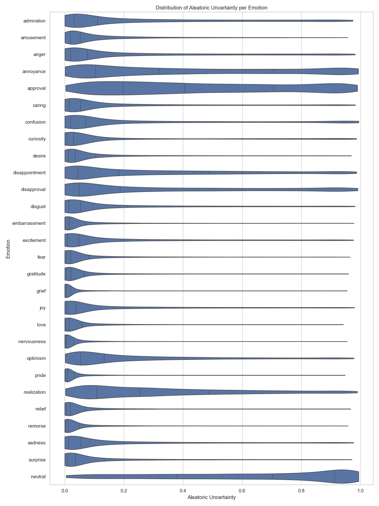
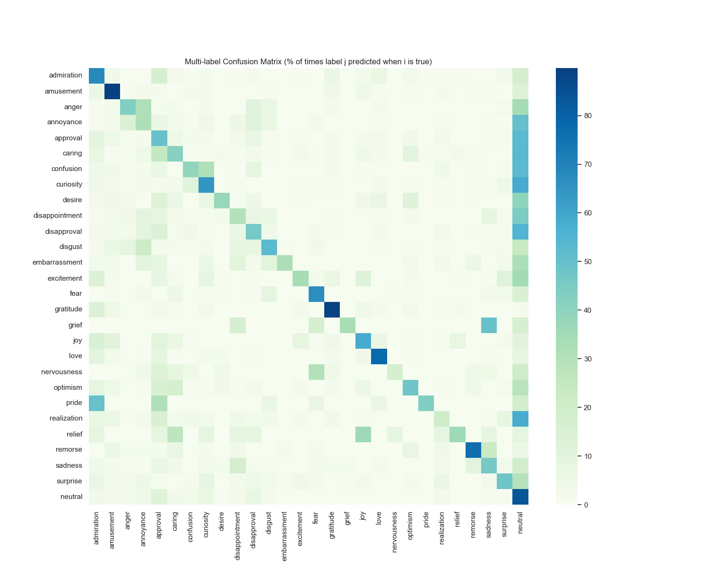
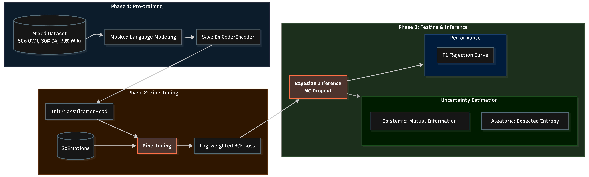

# EmCoder
> **Probabilistic Emotion Recognition & Uncertainty Quantification**<br>**28 Emotion multi-label Transformer (encoder) classifier**<br>**Model Repository:** **https://huggingface.co/yezdata/EmCoder**<br>**Live Demo & API Service:** [Try EmCoder on Hugging Face Spaces](https://yezdata-emcoder-api-ui.hf.space)


Unlike standard classifiers, EmCoder quantifies what it doesn't know using Monte Carlo Dropout, making it suitable for high-stakes AI pipelines.<br>
EmCoder is optimized for **MC Dropout inference**.


## SOTA benchmark
### Evaluation on the GoEmotions test split (macro avg metrics)
EmCoder achieves highly competitive Macro F1-score with its compact size (~35% smaller than RoBERTa-base and ~45% smaller than ModernBERT), while providing per-class epistemic uncertainty quantification.
| Model | Precision | Recall | F1-Score | Params | F1/M |
| :--- | :--- | :--- | :--- | :--- | :--- |
| **EmCoder** | **0.503** | **0.503** | **0.488** | **81.8M** | **0.0060** |
| Google BERT (Original) | 0.400 | 0.630 | 0.460 | 110M | 0.0042 |
| RoBERTa-base | 0.575 | 0.396 | 0.450 | 125M | 0.0036 |
| ModernBERT-base | 0.583 | 0.535 | 0.550 | 149M | 0.0037 |


## How to use
### 1. Setup & Tokenization
> EmCoder uses the `ModernBERT` tokenizer for correct token-to-embedding mapping.  
Ensure you allow remote code execution since it's a custom architecture.
```python
import torch
from transformers import AutoModel, AutoTokenizer

repo_id = "yezdata/EmCoder"

# Load the same tokenizer used during training
tokenizer = AutoTokenizer.from_pretrained("answerdotai/ModernBERT-base")

# Initialize with same config as training
model = AutoModel.from_pretrained(repo_id, trust_remote_code=True)
```
### 2. Bayesian inference
To obtain probabilistic outputs and uncertainty metrics, use the `mc_forward` method:
```python
# Perform 50 stochastic passes
N_SAMPLES = 50
MAX_BATCH_SIZE = 10 # optional sub-batching of N_SAMPLES

inputs = tokenizer("I am so happy you are here!", return_tensors="pt")

model.eval()
with torch.no_grad():
    # Automatically keeps Dropout active, even when in model.eval
    outputs = model.mc_forward(
        **inputs,
        n_samples=N_SAMPLES,
        max_batch_size=MAX_BATCH_SIZE
    )

# Bayesian Post-processing
mc_logits = outputs.logits
all_probs = torch.sigmoid(mc_logits) # (n_samples, B, 28)

mean_probs = all_probs.mean(dim=0) # Mean Predicted Probability
# base std estimation of Epistemic Uncertainty
uncertainty = all_probs.std(dim=0)

# Formatted Output
m_probs = mean_probs.squeeze(0)
u_vals = uncertainty.squeeze(0)

print(f"{'Emotion':<15} | {'Prob':<10} | {'Uncertainty':<10}")
print("-" * 40)

sorted_indices = torch.argsort(m_probs, descending=True)

for idx in sorted_indices:
    prob, unc = m_probs[idx].item(), u_vals[idx].item()
    label = model.config.id2label[idx.item()]
    
    if prob > 0.05: # Print only emotions with prob > 5%
        print(f"{label:<15} | {prob:>8.2%} | ±{unc:>8.4f}")
```


## Model Architecture



### Optimization
The model is trained using a **Weighted Binary Cross Entropy loss**  
Where weights $w$ are calculated using a logarithmic class-balancing scale to handle extreme label imbalance:

$$
w_{c} = \max\left( 0.1, \min\left( 20, 1 + \ln \left( \frac{N_{neg,c} + \epsilon}{N_{pos,c} + \epsilon} \right) \right) \right)
$$


## Performance on test set
**Using `thresholds.json` optimization of probabilty thresholds for binarizing predictions (from val set)**
|                | precision |   recall | f1-score |   support |
|:---------------|----------:|---------:|---------:|----------:|
| micro avg      |     0.524 |    0.635 |    0.574 |      6329 |
| **macro avg** | **0.503** |**0.503** |**0.488** |      6329 |
| weighted avg   |     0.537 |    0.635 |    0.573 |      6329 |
| samples avg    |     0.562 |    0.661 |    0.584 |      6329 |
|----------------|-----------|----------|----------|-----------|
| admiration     |     0.642 |    0.681 |    0.661 |       504 |
| amusement      |     0.731 |    0.898 |    0.806 |       264 |
| anger          |     0.491 |    0.434 |    0.461 |       198 |
| annoyance      |     0.352 |    0.316 |    0.333 |       320 |
| approval       |     0.273 |    0.501 |    0.354 |       351 |
| caring         |     0.271 |    0.415 |    0.327 |       135 |
| confusion      |     0.377 |    0.392 |    0.385 |       153 |
| curiosity      |     0.496 |    0.648 |    0.562 |       284 |
| desire         |     0.525 |    0.373 |    0.437 |        83 |
| disappointment |     0.272 |    0.305 |    0.288 |       151 |
| disapproval    |     0.333 |    0.461 |    0.387 |       267 |
| disgust        |     0.422 |    0.528 |    0.469 |       123 |
| embarrassment  |     0.545 |    0.324 |    0.407 |        37 |
| excitement     |     0.467 |    0.340 |    0.393 |       103 |
| fear           |     0.565 |    0.667 |    0.612 |        78 |
| gratitude      |     0.946 |    0.889 |    0.917 |       352 |
| grief          |     0.667 |    0.333 |    0.444 |         6 |
| joy            |     0.603 |    0.584 |    0.593 |       161 |
| love           |     0.809 |    0.782 |    0.795 |       238 |
| nervousness    |     0.500 |    0.174 |    0.258 |        23 |
| optimism       |     0.614 |    0.478 |    0.538 |       186 |
| pride          |     0.583 |    0.438 |    0.500 |        16 |
| realization    |     0.270 |    0.214 |    0.238 |       145 |
| relief         |     0.118 |    0.364 |    0.178 |        11 |
| remorse        |     0.551 |    0.768 |    0.642 |        56 |
| sadness        |     0.576 |    0.462 |    0.512 |       156 |
| surprise       |     0.511 |    0.482 |    0.496 |       141 |
| neutral        |     0.564 |    0.838 |    0.674 |      1787 |


### Entropy-based Uncertainty Decomposition
EmCoder computes probabilistic uncertainty using Information Theory metrics over $N$ stochastic forward passes


<br>**Demonstration of model uncertainty utilization**  
To validate uncertainty quantification, reject the top $X\%$ most uncertain (epistemic) classifications. The model's Macro F1 jumps from 0.488 to above 0.70, proving that the model's self-reported uncertainty is highly correlated with its actual error rate



<br>**Uncertainty quantification on GoEmotions test set for selected emotions**  
- `admiration`: medium appearance
- `fear`: minority representation
- `neutral`: the most samples

| Admiration | Fear |
| :---: | :---: |
|  |  |

**Neutral**
 


<br>**Emotion uncertainty distribution**  
| Epistemic | Aleatoric |
| :---: | :---: |
|  |  |

**Co-occurrence Confusion Matrix (normalized to Recall %)**


## Workflow



## Concrete Dropout Experiment 
An experimental branch of EmCoder integrated Concrete Dropout (Gal et al., 2017) to dynamically learn optimal dropout probabilities. While this marginally sharpened the isolation of extreme edge-cases (yielding a slightly steeper first part on the F1-Rejection curve with an optimized $p \approx 0.15$), the resulting heavier regularization constrained the capacity of compact EmCoder. This caused a slight degradation in standard macro metrics. Consequently, the production EmCoder model utilizes a fixed $p=0.1$ to maintain optimal encoder-classifier synergy.


## Note
Note that this model was trained on GoEmotions dataset (social networks domain) and it may not generalize well to other domains.


## Citation
If you use this model, please cite it as follows:

```bibtex
@misc{jez2026emcoder,
  author = {Václav Jež},
  title = {EmCoder},
  year = {2026},
  publisher = {Hugging Face},
  howpublished = {\url{https://huggingface.co/yezdata/EmCoder}},
  version = {1.0.0}
}
```